<div align="center">

# 📶 NetSpeed Indicator

### Real-time internet speed, right in your status bar.

A fast, private, beautifully animated network-speed meter for Android — live
download/upload speed as a status-bar icon, a floating bubble, home-screen widgets,
and an animated in-app dashboard. **No `INTERNET` permission. Your data never leaves
the device.**

<br>

[-2563EB?style=for-the-badge)](../../releases/latest)
&nbsp;
-3DDC84?style=for-the-badge&logo=android&logoColor=white)


</div>

---

## 🎬 See it move

Every animation below is **driven by your real network speed** — these are unedited
screen recordings from a Galaxy S25 Ultra.

<div align="center">

**The Journey scene: snail → bicycle → car → plane → rocket, as your speed climbs.**<br>
<sub>Transparent floating bubble + home-screen widget reading 14 MB/s — the red car era.</sub>

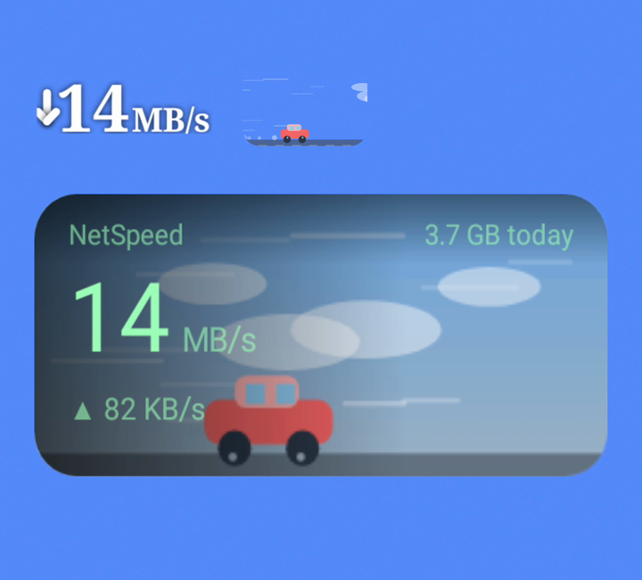

<br><br>

**Pick a scene by eye — live animated previews sweep through every speed tier.**

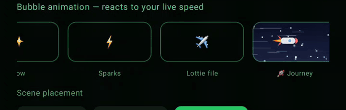

<br><br>

| The bubble IS the animation | Widgets animate at 24 fps |
|:---:|:---:|
| 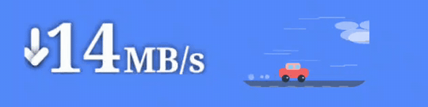<br><sub>icon background "None" → only the scene floats on your wallpaper</sub> | 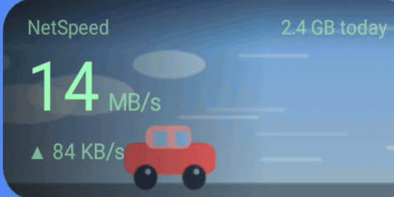<br><sub>launcher-side flip-book — smooth motion, zero extra battery</sub> |

| Hero banner, mid-download | Status bar, true colours |
|:---:|:---:|
| 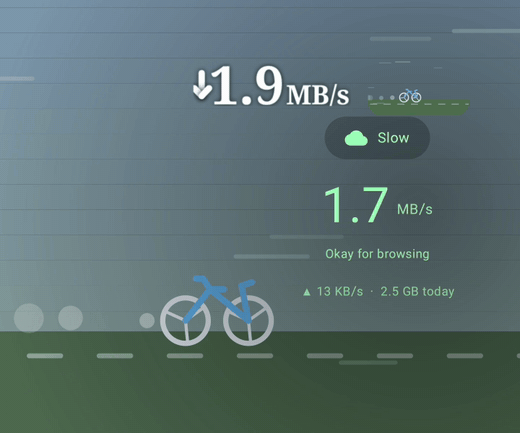<br><sub>bicycle through the field at 2 MB/s — environments blend, never snap</sub> | 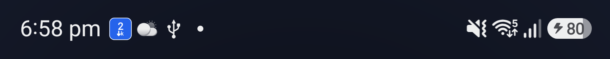<br><sub>your colours in the bar on One UI; max-contrast glyphs elsewhere</sub> |

<sub>📹 Full clips: <a href="docs/media/showreel.mp4">scene showreel</a> · <a href="docs/media/live-demo.mp4">live download demo</a></sub>

</div>

---

## 📸 Screenshots

<div align="center">

| Animated hero dashboard | Status-bar speed icon | Floating speed bubble |
|:---:|:---:|:---:|
| 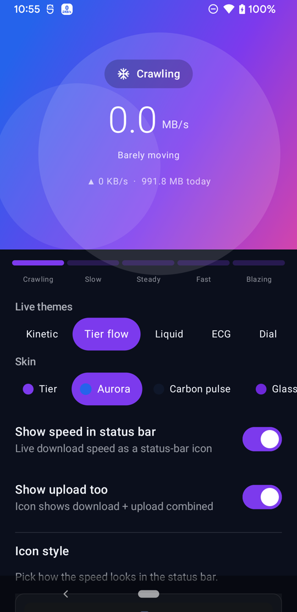 | 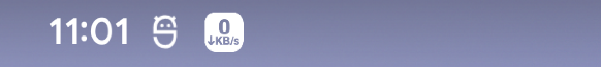<br><sub>full-height chip; glyphs punched out so it never tints to a blank box</sub> | 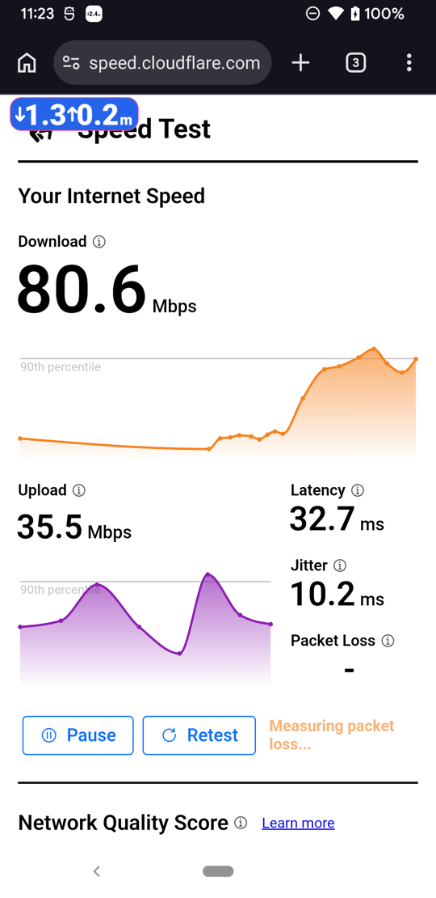<br><sub>live speed floating over any app — your colours, style &amp; upload</sub> |

| Notification + signal % | Icon styles & colours | Custom colour picker |
|:---:|:---:|:---:|
| 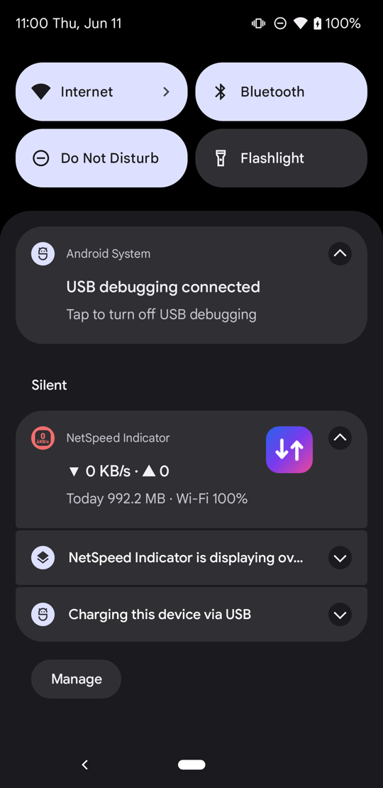 | 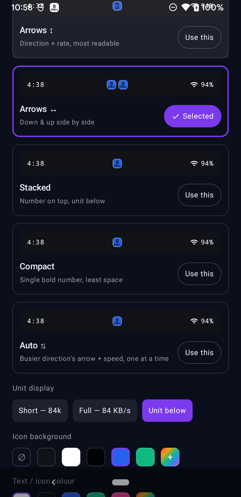 | 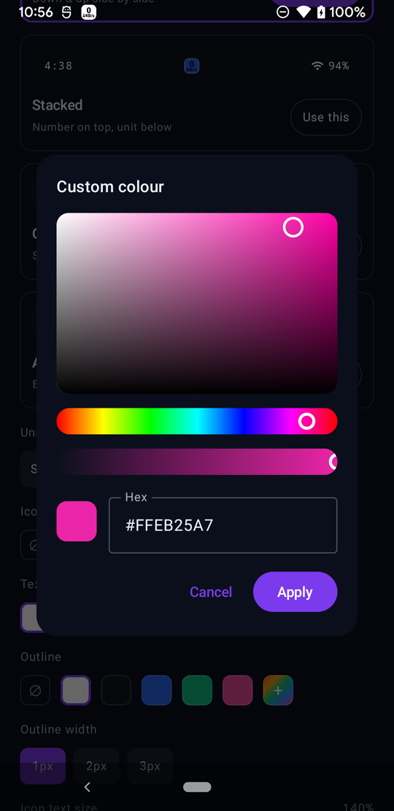 |

| Home-screen widget + bubble | | |
|:---:|:---:|:---:|
| 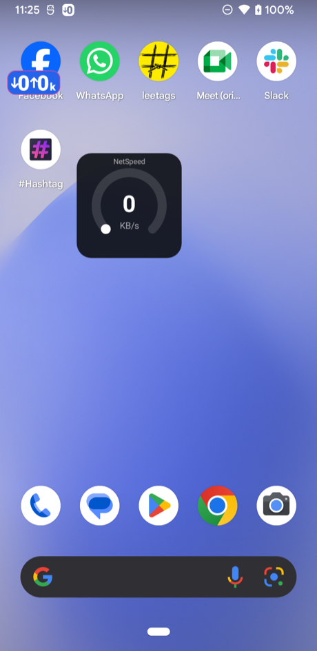<br><sub>any of 5 widget styles, one tap from the app</sub> | | |

</div>

---

## 🎨 26 live themes × 6 colour skins

Pick a **theme** for the motion and a **skin** for the palette — they compose. A skin
repaints the *whole* app in one identity: hero, chips, toggles, the home-screen widgets,
even the status-bar chip. Six of the combinations:

<div align="center">

| Aurora · Liquid | Tier · Tier flow | Carbon pulse · ECG |
|:---:|:---:|:---:|
| 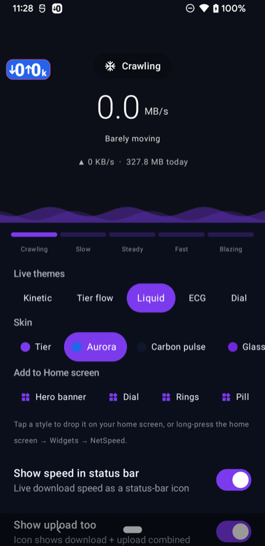 | 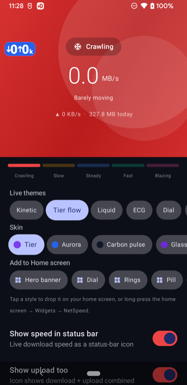 | 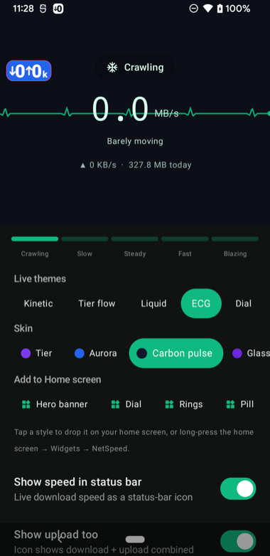 |

| Glasswave · Kinetic | Neo-brutal · Brutalist | Terminal · Terminal |
|:---:|:---:|:---:|
| 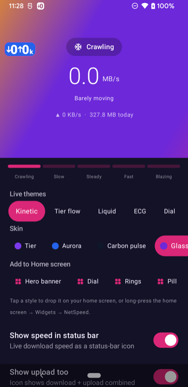 | 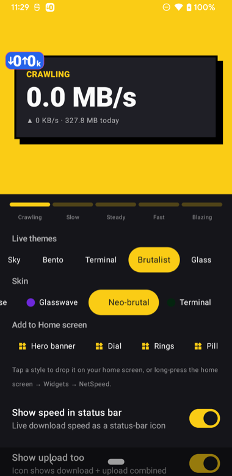 | 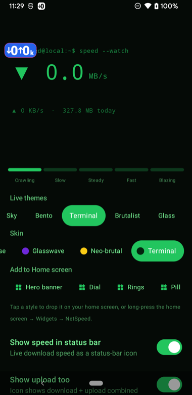 |

</div>

> Themes: Kinetic · Tier flow · Liquid · ECG · Dial · Radar · Particles · Curtains ·
> Material You · Sky · Bento · Terminal · Brutalist · Glass · Speedtest — plus 11
> **speed scenes**: Journey · Comet · Heartbeat · Manga · Data river · Fireflies ·
> Blob · Turbine · Runner · Lightning jar · Tachometer.
> Skins: Tier · Aurora · Carbon pulse · Glasswave · Neo-brutal · Terminal.

---

## ✨ Features

### Status-bar speed icon
- **5 styles** — Arrows ↕, Arrows ↔ (side-by-side), Stacked, Compact, and **Auto ⇅**
  (shows whichever direction is busier, one at a time).
- **Unit display** your way — `84k` (short), `84 KB/s` (full), or number-over-unit.
- **Custom colours** — background, text, and an **outline** chip (colour + 1–3 px width).
- **Size slider** + respects your system font scale.
- **Auto-hide when idle** — the icon disappears after 30 s of no traffic and snaps
  back the instant data flows.

### 🫧 Floating speed bubble
- A small **draggable chip** that floats over every app. Because it's *our* surface (not
  the OS-tinted status-bar slot) it renders the **exact same icon** you configured —
  style, unit, background, text colour, outline **and the upload value** — in full colour.
- Independently **size-configurable**; tap it to open the app; remembers where you drop it.

### 🏠 Home-screen widgets (×5)
- **Hero** (gradient banner), **Dial**, **Rings**, **Pill**, **Weather**.
- An **“Add to Home screen”** row sits right under the live hero — tap any style and the
  launcher drops that widget straight onto your home screen. Or use the launcher's own
  widget picker.

### 🎨 Animated dashboard
- **26 live themes** (Kinetic, Tier flow, Liquid, ECG, Dial, Radar, Particles, Curtains,
  Material You, Sky, Bento, Terminal, Brutalist, Glass, Speedtest + 11 speed scenes) ×
  **6 colour skins** (Tier, Aurora, Carbon, Glasswave, Neo-brutal, Terminal).
- **Speed scenes** — tiny procedural dioramas DRIVEN by your live speed: the Journey
  world climbs from a crawling snail through bicycle, car and plane to a rocket in
  space as your connection speeds up; a comet grows its tail, a stick runner sprints,
  an RPM bar shifts gears. One renderer powers the hero banner, the home-screen
  widgets AND the floating bubble (beside the text or as its animated background),
  with live previews in settings to pick by eye.
- Smooth, gemini-style **flowing gradients** (constant-velocity, reduced-motion aware).
- A Material 3 **design system** whose primary/secondary/tertiary colours all derive
  from the active skin.

### 📊 Insight
- **Smoothed** readout (no jittery numbers), **Wi-Fi / mobile signal %** in the panel,
  **today / 30-day history / lifetime** usage, and a daily-quota ring.

### 🔒 Privacy
- Ships with **no `android.permission.INTERNET`** — a verifiable guarantee the app
  *cannot* phone home. Speed is read from kernel `TrafficStats` counters. No ads,
  no trackers, no analytics SDKs.

---

## ⬇️ Install (from GitHub)

1. Open the **[latest release](../../releases/latest)** and download the `.apk`.
2. On your phone, tap the file → allow **“Install unknown apps”** for your browser /
   Files app if prompted.
3. Open **NetSpeed Indicator**, flip **“Show speed in status bar”** on, and grant the
   notification permission. Done.

> First-launch tip: if your phone (Samsung One UI / MIUI) collapses status-bar
> notification icons into a single dot, the app’s **“Icon not showing? (status-bar dot)”**
> card walks you through the one system toggle to fix it.

---

## 🛠️ Build from source

Requires **JDK 17** (newer JDKs crash the Kotlin compiler used here).

```bash
export JAVA_HOME=/path/to/jdk-17
git clone git@github.com:soumyasethy/netspeed-indicator-android.git
cd netspeed-indicator-android
./gradlew assembleDebug            # debug APK (installable, debuggable)
./gradlew testDebugUnitTest        # unit tests
./gradlew assembleRelease          # release APK (signed if keystore.properties present)
```

Release signing is read from a gitignored `keystore.properties` at the repo root:
```properties
storeFile=keystore/release.jks
storePassword=…
keyAlias=…
keyPassword=…
```

## 🧱 Tech

Kotlin · Jetpack Compose + Material 3 · DataStore · foreground service (`specialUse`) ·
Android Canvas · Lottie (local animation rendering only) · `min SDK 26 / target 35` ·
Gradle Kotlin DSL + version catalog · **no ads, no trackers, no network SDKs** — and
still zero `INTERNET` permission.

Architecture and design notes live in [`docs/context/`](docs/context/CONTEXT.md).
